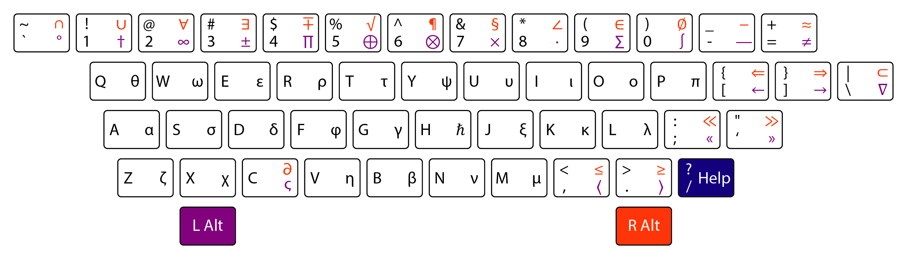

# Bubble

Additional keyboard layouts for mathematical and physical symbols.



---

- [Install](#install)
- [Usage](#usage)
- [Settings](#settings)
- [License](#license)
- [Build Instructions](#build-instructions)

---

## Install

### First method — Scoop

The preferred installation method is via [Scoop](https://scoop.sh/) package manager.

1. Add repo (if not already added).

```sh
scoop bucket add shell https://github.com/deverte/scoop-shell
```

2. Download and install `Bubble`.

```sh
scoop install bubble
```

### Second method — Direct download

Also you can download a [package](https://github.com/deverte/bubble/releases) and unpack it via any ZIP archiver.

### How to add Bubble at system startup

You can create a shortcut on `bubble.exe` in the directory `%AppData%\Microsoft\Windows\Start Menu\Programs\Startup`.

## Usage

> Bubble contains a limited number of characters and is only good for fast typing of common symbols.
> For an extended character set, it is recommended to use Bubble in conjunction with [Warp](https://github.com/deverte/keypirinha-warp) or something like this.

First you need to start `bubble.exe`.

There are two main "layouts" for additional symbols — "**Right Alt**" and "**Left Alt**".
For example, you can hold down **Left Alt** key and **a** key and the result will be "α".

You can see all the symbols in the "Help", which can be called with the combination "**Alt+/**" or "**Alt+?**".


The magenta symbols correspond to the "**Left Alt**" layout, and red ones to the "**Right Alt**" layout.

> A lot of applications need the "Alt" key shortucts.
> For this reason, it is not recommended to constantly use Bubble, but enable it only while typing.

## Settings

There are several parameters that can be set in `config.ini` file in the program directory.
All settings affect only the appearance of the "Help" window.
And there is only a `[style]` block.

The settings will be presented as:

```ini
parameter=default_value ; description
```

`config.ini`:

```ini
[style]
x=Center          ; help window start x position (use `Center` to set center position)
y=Center          ; help window start y position (use `Center` to set center position)
width=1280        ; help window width
height=366        ; help window height
bgcolor=35363A    ; help window background color (hex)
transparency=255  ; help window transparency (0-transparent, 255-opaque)
```

## License

This package is distributed under the terms of the [MIT license](./LICENSE).

## Build Instructions

You can build this project with [AutoHotkey](https://www.autohotkey.com/).

```sh
ahk2exe.exe /in bubble.ahk /out bubble.exe
```